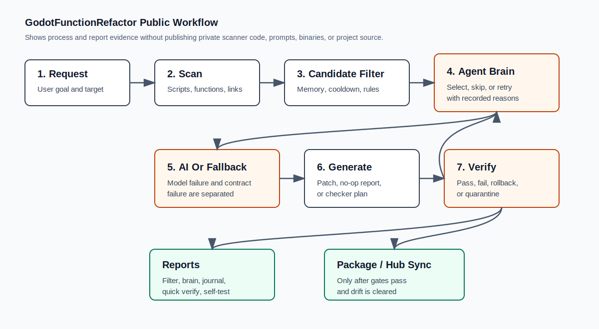

# Godot AI Workflow Showcase

This repository is a public preview of a Godot workflow shaped by local
scanner, reportbook, and AI-guard tooling.

It is meant to answer one practical question:

> What result does this tool produce, and what process does it follow before an
> AI-generated change is trusted?

The private scanner implementation, full local journals, prompts, packaged EXE,
ZIP files, and private Godot project source are not included here.



## What This Shows

- How an AI worker starts from a lead file instead of scanning blindly.
- How scan summaries and reportbook files provide evidence before edits.
- How candidate filtering records failure memory, cooldowns, and do-not-repeat
  rules.
- How local AI failure is separated into model failure and response-contract
  failure.
- How function connection filtering helps find related functions across `.gd`
  files.
- How verification decides whether the result can be kept, rejected, packaged,
  or synced to a hub.

## Main Example: GodotFunctionRefactor

GodotFunctionRefactor is a local Godot code-factory workflow. It scans a copied
project or sandbox, builds a candidate list, lets an agent brain choose or skip
work with recorded reasons, optionally asks local AI for a bounded proposal, and
then writes reports plus verification evidence.

Start here:

- [Workflow overview](docs/GODOT_FUNCTION_REFACTOR_FLOW.md)
- [Factory reportbook guide](docs/FACTORY_REPORTBOOK.md)
- [Sanitized factory run sample](docs/SAMPLE_FACTORY_RUN.md)
- [Copy AI intake sample](docs/SAMPLE_COPY_AI_INTAKE.md)
- [Function connection report sample](docs/SAMPLE_FUNCTION_CONNECTION_REPORT.md)

## Result Preview

A sanitized run can show results like this:

| Check | Public result |
| --- | --- |
| Factory self-test | pass |
| Self-test errors | 0 |
| Self-test warnings | 0 |
| Checked files | 136 |
| Quick verify after hub sync | pass |
| Quick verify errors | 0 |
| Quick verify warnings | 0 |
| Package/hub drift | false |
| ZIP entry count | 75 |

This is not a claim that GitHub contains the full product. GitHub shows the
process evidence and public samples. The commercial package is distributed
separately.

## Repository Map

```text
assets/
  factory_process_map.svg
docs/
  LEAD.md
  AI_WORK_LOG_EXCERPT.md
  SAMPLE_SCAN_SUMMARY.md
  GODOT_FUNCTION_REFACTOR_FLOW.md
  FACTORY_REPORTBOOK.md
  SAMPLE_FACTORY_RUN.md
  SAMPLE_COPY_AI_INTAKE.md
  SAMPLE_FUNCTION_CONNECTION_REPORT.md
samples/
  game_session_signal_flow.gd
  player_leveling_role_boundary.gd
  player_weapon_controller_excerpt.gd
  skill_catalog_data_boundary.gd
LICENSE
README.md
```

## Workflow Preview

```text
1. Read docs/LEAD.md.
2. Read the latest work-log excerpt or reportbook sample.
3. Read the scan summary.
4. Inspect only the named gameplay files or function clusters.
5. Make focused code changes in a copy or sandbox.
6. Run tool checks.
7. Record the outcome for the next AI pass.
8. Package or sync only after verification gates pass.
```

## itch.io

The commercial download page will be linked here:

https://itch.io/

The intended flow is two-way:

- GitHub shows the public evidence, samples, and workflow.
- itch.io provides packaged downloads, paid editions, and release files.

## License

This repository is a public showcase, not an open-source release. See
[`LICENSE`](LICENSE).
