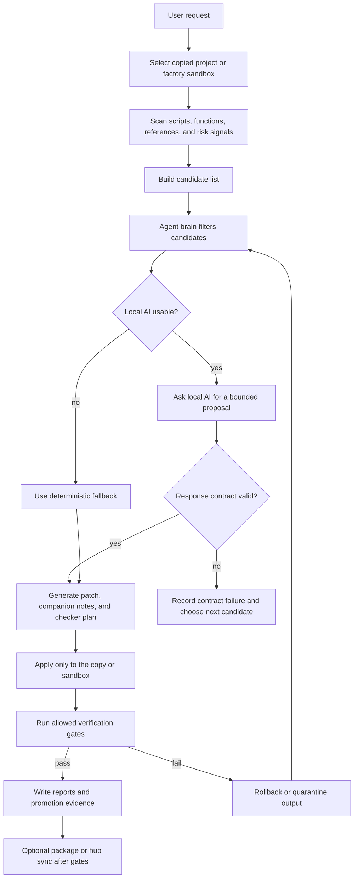

# GodotFunctionRefactor Workflow

This page explains the public shape of the local Godot code-factory workflow.
The private scanner implementation, local prompts, full journals, binaries, and
project source are intentionally not included in this showcase.

## What The Tool Is For

GodotFunctionRefactor is a local workflow tool for AI-assisted Godot code work.
Its job is not to let an AI edit a project blindly. The tool turns a broad
request into a controlled process with scan evidence, candidate selection,
copy-first application, verification, and report output.

## Process

## Candidate Selection

The agent brain is expected to explain why a candidate was selected or skipped.
Important skip reasons include:

- recent failure memory
- cooldown windows
- do-not-repeat rules
- missing reproduction evidence
- local AI unavailable
- local AI model failure
- local AI response-contract failure

The public takeaway is simple: a skipped candidate should leave evidence. The
next AI pass should not have to guess why a file, function, or patch was avoided.

## Local AI Failure Classes

The workflow separates two common AI failure types:

| Failure class | Meaning | Next action |
| --- | --- | --- |
| Model failure | The local model or endpoint was unavailable, timed out, or returned no usable answer. | Prefer another candidate, fallback path, or later retry. |
| Response-contract failure | The model answered, but did not satisfy the required JSON/patch/report contract. | Penalize that route for this candidate and choose a safer next step. |

This distinction matters because an unavailable model is different from an
untrustworthy proposal. Treating both as the same failure makes later candidate
selection weaker.

## Result Boundary

The tool is designed to produce evidence before changes are trusted:

- a candidate filter report
- an agent-brain state report
- a decision journal
- a generated report or patch summary
- verification output
- package or hub sync status when packaging is performed

The actual commercial package and private implementation are distributed outside
this public showcase.
